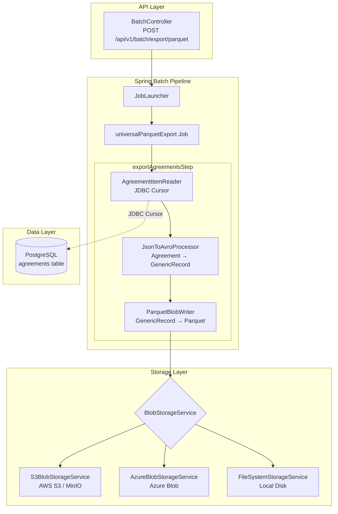
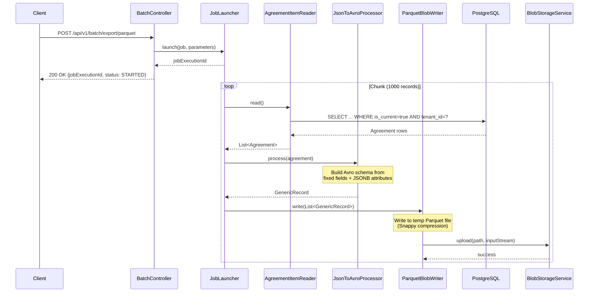

# Analytics Layer Architecture

## Overview

The Beema Analytics Layer provides a cloud-agnostic data export pipeline that transforms operational insurance data into columnar Parquet files for downstream analytics. It is built on Spring Batch for reliable, restartable processing and supports pluggable blob storage backends.

## System Architecture



## Component Interaction Flow



## Data Flow

```
PostgreSQL (JSONB)
    │
    │  JDBC Cursor (fetch size: 1000)
    │  SQL: SELECT ... FROM agreements WHERE is_current = true AND tenant_id = ?
    ▼
Agreement Entity
    │
    │  JsonToAvroProcessor
    │  - Fixed fields → Avro fields
    │  - JSONB attributes → attr_* fields (flattened)
    │  - Dynamic schema built from first record
    ▼
Avro GenericRecord
    │
    │  ParquetBlobWriter
    │  - AvroParquetWriter (Snappy, 1MB pages, 128MB row groups)
    │  - Write to temp file → upload to blob storage
    ▼
Parquet File (in Blob Storage)
    Path: tenant={id}/object=agreement/date={date}/{uuid}.parquet
```

## Technology Stack

| Component         | Technology                 | Version  | Purpose                                    |
|-------------------|----------------------------|----------|--------------------------------------------|
| Batch Framework   | Spring Batch               | 5.x      | Reliable chunk-oriented processing         |
| Serialization     | Apache Avro                | 1.11.x   | Schema-based record serialization          |
| Columnar Format   | Apache Parquet             | 1.13.1   | Compressed columnar storage                |
| Hadoop Libraries  | Apache Hadoop Common       | 3.3.6    | File I/O required by Parquet               |
| Database          | PostgreSQL                 | 15+      | Source data with JSONB flex-schema          |
| AWS Storage       | AWS SDK v2 (S3)            | 2.20.0   | S3 and MinIO blob storage                  |
| Azure Storage     | Azure Storage Blob SDK     | 12.20.0  | Azure Blob Storage                         |
| Compression       | Snappy                     | built-in | Fast compression for Parquet               |

## Design Decisions

### Why Parquet?

Parquet is the industry standard for analytics workloads:

- **Columnar storage** -- Analytics queries typically scan a subset of columns. Parquet's columnar layout means only relevant columns are read from disk, reducing I/O by 10-100x compared to row-oriented formats (CSV, JSON).
- **Built-in compression** -- Snappy compression provides a balance of speed and ratio. Columnar layout compresses better because similar values are stored together.
- **Schema evolution** -- Parquet files carry their schema, making them self-describing. New columns can be added without breaking existing consumers.
- **Ecosystem compatibility** -- Native support in Spark, Trino, Athena, BigQuery, Snowflake, DuckDB, Pandas, and Polars. No ETL pipeline needed to query exports.
- **Predicate pushdown** -- Query engines can skip entire row groups based on column statistics, accelerating filtering.

### Why Avro as an Intermediate Format?

Avro serves as the bridge between Java domain objects and Parquet:

- **Dynamic schema construction** -- The JSONB `attributes` column contains arbitrary key-value pairs per tenant. Avro schemas are built programmatically at runtime from the first record's attributes, so the export adapts to any tenant's data shape without code changes.
- **Parquet-Avro integration** -- The `parquet-avro` library provides `AvroParquetWriter`, which handles the Avro-to-Parquet column mapping automatically.
- **Type safety** -- Avro's `GenericRecord` enforces field types at write time, catching data issues before they reach the Parquet file.

### Why Spring Batch?

- **Chunk-oriented processing** -- Memory-efficient streaming with configurable chunk sizes (default: 1000). Processes millions of records without loading all into memory.
- **Restartability** -- Job state persisted to `BATCH_*` tables in PostgreSQL. Failed jobs can be restarted from the last successful chunk.
- **Transaction management** -- Each chunk is processed in a database transaction. Failures roll back only the current chunk.
- **Built-in metrics** -- Read count, write count, skip count, and processing time tracked per step.
- **Async execution** -- Jobs run asynchronously via `JobLauncher`, returning immediately with a tracking ID.

### Why BlobStorageService Abstraction?

The `BlobStorageService` interface decouples the export pipeline from any specific cloud provider:

```java
public interface BlobStorageService {
    void upload(String path, InputStream stream) throws IOException;
    InputStream download(String path) throws IOException;
    String getSignedUrl(String path, Duration expiration) throws IOException;
}
```

- **Local development** -- `FileSystemStorageService` writes to disk. No cloud credentials needed.
- **MinIO** -- `S3BlobStorageService` with a custom endpoint simulates S3 locally via Docker.
- **Production** -- Switch between AWS S3 and Azure Blob Storage with a single config property (`beema.storage.type`).
- **Testing** -- Filesystem backend for integration tests; no external dependencies.

## Scalability Considerations

### Current Capacity

| Parameter             | Value     | Impact                                      |
|-----------------------|-----------|---------------------------------------------|
| Chunk size            | 1,000     | Records processed per transaction           |
| JDBC fetch size       | 1,000     | Rows fetched per database round-trip        |
| Parquet page size     | 1 MB      | In-memory buffer before flushing to disk    |
| Row group size        | 128 MB    | Parquet row group (optimized for analytics) |
| HikariCP pool size    | 20        | Concurrent database connections             |
| Snappy compression    | ~2-4x     | Typical compression ratio for mixed data    |

### Scaling Strategies

1. **Vertical** -- Increase chunk size and JDBC fetch size for higher throughput on larger instances.
2. **Partitioned steps** -- Spring Batch supports partitioning a step across multiple threads, each processing a slice of data (e.g., by `market_context` or date range).
3. **Multiple workers** -- Deploy multiple beema-kernel instances, each picking up different tenant exports from a job queue.
4. **Date-range sharding** -- For very large tenants, break exports into monthly or weekly Parquet files by passing `fromDate`/`toDate` parameters.

### File Size Guidelines

| Record Count | Approximate Parquet Size | Export Time (estimate) |
|--------------|--------------------------|------------------------|
| 10,000       | 1-5 MB                   | < 10s                  |
| 100,000      | 10-50 MB                 | < 60s                  |
| 1,000,000    | 100-500 MB               | 2-5 min                |

Actual sizes depend on the number of JSONB attributes per record and their value lengths.

## Tenant Isolation

Tenant isolation is enforced at multiple layers:

1. **SQL query** -- `WHERE tenant_id = ?` filters at the database level.
2. **Blob path** -- `tenant={tenantId}/...` prefixes isolate files in storage.
3. **Job parameters** -- Each job execution is scoped to a single tenant.
4. **Row-Level Security** -- PostgreSQL RLS policies provide defense-in-depth.
